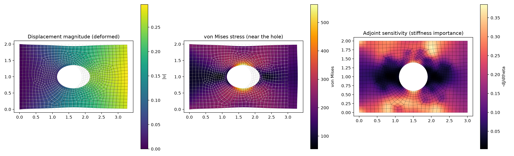

# Matrix-free Newton–Krylov FEA in PyTorch

[](https://colab.research.google.com/github/<YOUR-USER>/<YOUR-REPO>/blob/main/PyTorch/colab_gpu.ipynb)  ← one click: run it on a free Google GPU (no setup, no Google-account access)

Large-strain (neo-Hookean) finite element analysis in **purely functional PyTorch** — no classes, no
assembled stiffness matrix. Derivatives (stress, internal forces, tangent products, design
sensitivities) are produced by `torch.func` (`grad`, `jvp`, `vjp`, `vmap`, `jacfwd`), never derived by hand.



## Features

| | |
|---|---|
| **Elements** | Q4, Q8 (serendipity), Q9, Tri3, Tri6, selected by name from one element library |
| **Geometries** | rectangle, L-bracket, plate with a hole, plate with two notches (Gmsh) — structured rectangle meshes need no mesher |
| **Materials** | library of hyperelastic energies, selectable in the GUI: neo-Hookean, Mooney–Rivlin, Saint Venant–Kirchhoff, Demiray (exponential), and a **fibre-reinforced HGO model** (two fibre families, adjustable angle and dispersion, fibres carry load only in tension). Add a model by writing one energy function. |
| **Solver** | matrix-free inexact Newton–Krylov: preconditioned CG on `jvp` products (Jacobi, nodal block-Jacobi, or ILU of the assembled tangent — ILU cuts CG iterations 40–100× on the benchmarks), Eisenstat–Walker forcing, Armijo line search, **adaptive load stepping** (increment is halved automatically if a step fails) |
| **Loads / supports** | clamps and rollers on any side; consistent (work-equivalent) edge tractions or prescribed displacements |
| **Sensitivities** | exact adjoint gradient w.r.t. element stiffness (one extra linear solve, no assembled matrix) |
| **Post-processing** | Cauchy and von Mises stress, det F, strain energy, support reactions, equilibrium check |
| **GUI** | Streamlit app: change geometry, element type, element size (mesh density), material, supports and load, then solve and inspect fields and convergence |
| **Tests** | 100+ tests incl. a finite-strain patch test for every element, rigid-body invariance, adjoint vs finite differences |

## GPU / Google Colab

> **Set-up:** replace `<YOUR-USER>/<YOUR-REPO>` in the badge and set `REPO` / `SUBDIR` / `REF` (a pinned commit hash) in the first code cell of `colab_gpu.ipynb`; the repository must be public.

`build_problem(spec)` accepts `spec["device"]="cuda"`; the solver, operators and post-processing are
device-agnostic. A ready-made notebook (`colab_gpu.ipynb`) runs the benchmark and a GPU solve on the free
Colab GPU **without** touching your Google account (no Drive, no secrets, no public tunnel; commit and package versions are pinned). **Status:** the device code paths are written and run on the CPU; they have
not yet been verified on a real CUDA GPU. On the CPU the tangent product scales linearly
(60,000 Q4 elements: ~100 ms).

## Quick start

```bash
python -m venv .venv && source .venv/bin/activate
pip install -r requirements.txt

streamlit run streamlit_app.py          # the GUI
python examples/quickstart.py               # 10-line script
python examples/benchmark_plate_with_hole.py quad9
python -m pytest -q                         # test-suite (~2 min)
```

```python
import torch
from scr.Problem import default_spec, build_problem
from scr.Newton_Krylov import newton_krylov_solve
from scr.Postprocess import compute_fields

params = build_problem(default_spec("plate_hole", element_type="tri6", h=0.2))
theta = torch.ones(params["conn"].shape[0], dtype=torch.float64)
u, info = newton_krylov_solve(params, theta, n_load_steps=3, tol=1e-5)
fields = compute_fields(u, theta, params)       # stresses, J, energy, ...
```

## How it is organised

```
scr/
  shape_functions_2D.py   N_a(xi, eta) for all elements
  Elements.py             element library (one dict row per element type)
  Gauss_Quadratures.py    1D, square and triangle rules
  Kinematics.py           isoparametric map, Jacobian, deformation gradient F
  Constitutive_Relations.py   neo-Hookean psi(F) and P = d psi / dF (teaching version)
  Materials.py            material library (neo-Hookean, Mooney-Rivlin, SVK, Demiray, fibre-reinforced)
  Weak_Form.py            virtual work at a Gauss point / element
  Operators.py            residual, cached geometry, A(v)=J v (jvp), A^T(v) (vjp), Jacobi diagonal
  Newton_Krylov.py        PCG, line search, Newton, adaptive load continuation
  Boundary_Conditions.py  boundary selection, consistent edge loads, Dirichlet by torch.where
  Mesh.py / Gmsh_Mesh.py  structured and Gmsh meshes
  Adjoint.py / Sensitivity.py   implicit-function-theorem sensitivities
  Problem.py              spec dict -> params dict
  Postprocess.py / Plotting.py  fields, reactions, contour plots
streamlit_app.py      the GUI
examples/                 quickstart and benchmarks
test/                     pytest suite
```

Design rules: state lives in plain dictionaries (`spec`, `params`, `fields`); linear operators are
closures `v -> A(v)`; per-element work is written for *one* element and mapped with `vmap`;
local–global coupling is one gather and one `index_add_`; Dirichlet conditions use masks and
`torch.where`, never slicing or in-place writes.

## Verification (what the tests assert)

* shape functions: Kronecker delta, partition of unity, AD gradients vs finite differences
* quadrature rules exact up to their degree (triangle rules to degree 8)
* rigid translation/rotation give zero internal force (all elements)
* tangent operator: symmetric, SPD, `A^T` = transpose, matrix-free diagonal exact, `jvp` = finite difference
* **finite-strain patch test**: an affine boundary motion is reproduced exactly inside an unstructured mesh
* global equilibrium: support reactions + applied load = 0
* adjoint gradient equals central finite differences

## Security

The GUI binds to localhost; Gmsh runs in a child process on a fixed script with a JSON request (no shell,
no executed user strings); the repository contains no credentials. In Colab never mount Drive or paste
tokens into the notebook, and run only notebooks you have read.

## Limitations

Plane strain, unit thickness, dead loads; hyperelastic (no plasticity/damage); displacement-only formulation (volumetric locking as
ν → 0.5); the diagonal preconditioner is weak for quadratic elements and bending-dominated parts
(many CG iterations) — a stronger matrix-free preconditioner is the natural next step.
