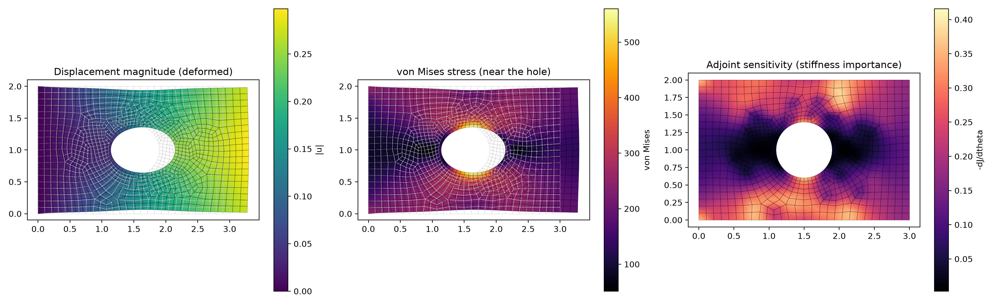
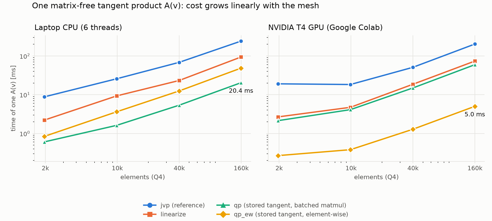
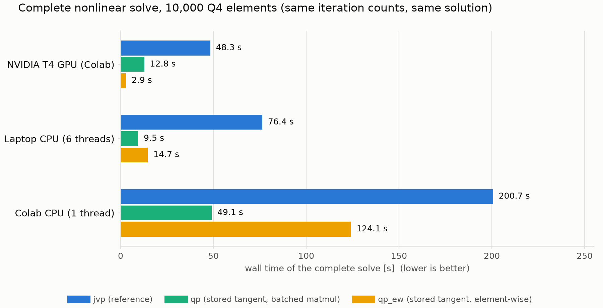
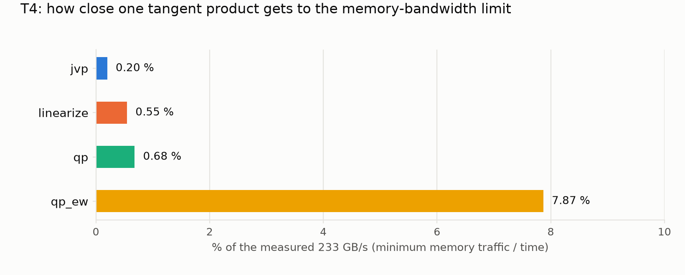
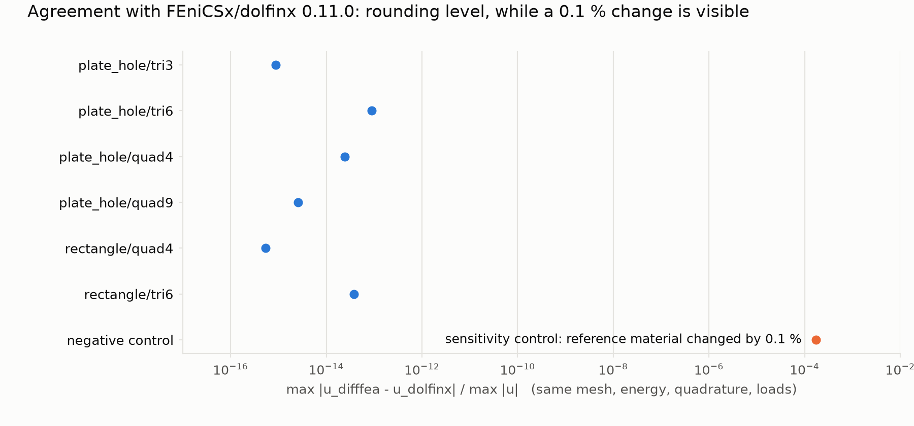

# Differentiable-FEA

**Differentiable, matrix-free finite element analysis for large-strain hyperelasticity, in purely functional PyTorch.**
Derivatives (stress, tangent products, design sensitivities) come from automatic differentiation (`torch.func`), the
global stiffness matrix is never assembled, and the same code runs on a CPU and on a GPU.

[](https://colab.research.google.com/github/miladshirani/Differentiable-FEA/blob/main/notebooks/colab_gpu.ipynb)
&nbsp; Apache-2.0 &nbsp;|&nbsp; Python 3.10+ (tested on 3.12 and 3.13) &nbsp;|&nbsp; PyTorch 2.2+ (tested with 2.11 and 2.14)


<sub>Plate with a hole in tension (Q9 elements, neo-Hookean, about 10 % stretch): displacement, von Mises stress, and the exact
adjoint sensitivity of the compliance with respect to the stiffness of every element. Reproduce:
`python examples/benchmark_plate_with_hole.py quad9`.</sub>

> **Status: early development (v0.1.0.dev0).** Today this is a verified **2D, single-process** solver that runs on a
> CPU and on one GPU. It is **not yet a distributed-memory HPC code**: there is no multi-GPU or MPI support, no
> multigrid-type preconditioner and no 3D. [docs/ROADMAP.md](docs/ROADMAP.md) lists what is planned, and
> [docs/KNOWN_ISSUES.md](docs/KNOWN_ISSUES.md) what is known to be limited. Every number on this page comes from a script
> in `benchmarks/` and a result file in `benchmarks/results/`.

## Highlights

* **Correct.** The solution matches FEniCSx/dolfinx to rounding level (<= 9e-14 relative) on an identical discrete problem,
  and matches beam theory and the Kirsch/Heywood stress concentration. 194 tests pass (3 more run only where dolfinx is installed).
* **Fast where it counts.** Profiling the matrix-free tangent product led to a formulation that is **11.6x faster on a
  GPU** than the first version; a complete nonlinear solve takes **2.9 s on a free Colab T4** against 48 s before and 9.5 s on a
  6-thread laptop CPU.
* **Differentiable.** Exact adjoint sensitivities by the implicit function theorem (one extra linear solve), checked against
  finite differences.
* **Functional and small.** No classes in the numerical code: state is plain dictionaries, operators are closures; a new
  material is one energy function.
* **Safe to try.** A Colab notebook runs it on a free GPU without access to your Google account (see [Google Colab](#google-colab)).

## Performance

All numbers: float64, Q4 elements, uniaxial tension, neo-Hookean, Jacobi-preconditioned CG, one run each (repeat timings vary
by about 10 %). "A(v)" is the tangent product, the operation inside every Krylov iteration. The four variants apply **the
same linear operator** (tests: agreement to 1e-11 for every element and material; complete solutions differ by <= 6e-12).

| variant | what it does |
|---|---|
| `jvp` | forward-mode AD of the whole residual at every product (the straightforward version, kept as the reference) |
| `linearize` | evaluates the residual once per Newton step, then only pushes the tangent through (`torch.func.linearize`) |
| `qp` | stores the tangent moduli `d2psi/dF2` at the Gauss points once per Newton step; a product is gather, batched 4x4 matmul, scatter |
| `qp_ew` | same as `qp` with element-wise multiply-and-sum instead of batched GEMM |
| `auto` (default) | `qp_ew` on CUDA, `qp` on the CPU |





| 10,000 Q4 elements, complete solve | `jvp` | `qp` | `qp_ew` |
|---|---|---|---|
| NVIDIA T4 GPU (free Colab) | 48.3 s | 12.8 s | **2.90 s** |
| Laptop CPU (6 threads) | 76.4 s | 9.45 s | 14.7 s |
| Colab CPU (1 thread) | 200.7 s | 49.1 s | 124.1 s |

**What the profiler found.** On the T4 the first stored-tangent version (`qp`) reached only 0.68 % of the memory bandwidth, and
88 % of its time was spent in cuBLAS batched double-precision GEMM applied to 2x2 and 4x4 matrices, a poor fit for a GPU. Writing
the same contractions as element-wise operations (`qp_ew`) made the product 11.6x faster (1.28 ms vs 14.9 ms at 40k elements,
5.0 ms vs 59 ms at 160k) and reaches 7.9 % of the bandwidth. On a CPU the opposite holds (`qp_ew` is 2.3x slower than `qp` on the laptop, 2.9x on Colab's CPU), which is
why the default depends on the device.



**What these numbers do not say.**

* The T4 is a modest, shared, free GPU with weak float64 units; the Colab CPU has a single thread. Compare devices with care.
* On this CPU, in 2D, an **assembled sparse matrix is still faster per product** than any matrix-free variant (CSR matvec 0.61 ms
  against 6.4 ms for `qp`, 40k Q4 elements, laptop; `benchmarks/results/profile_cpu_quad4.json`). Matrix-free is expected to pay off
  for high-order elements, 3D and GPU memory; that has **not been measured yet**.
* GPU memory per variant, float32, ILU on the GPU (it is CPU-only) and anything beyond one T4 are unmeasured.

## Validation



| Check | Result | Reproduce |
|---|---|---|
| **Identical discrete problem vs FEniCSx/dolfinx 0.11.0** (same mesh, neo-Hookean energy, Gauss rule, clamp + dead load, 3 load steps; plate with hole and cantilever; Tri3, Tri6, Q4, Q9) | displacement, strain energy and reaction agree to **<= 9e-14** relative; a deliberate 0.1 % change of the reference material shows up as 1.7e-4, so the comparison is sensitive | `benchmarks/validate_against_dolfinx.py` -> `benchmarks/results/validate_dolfinx.json` |
| Cantilever vs Timoshenko beam theory (plane strain, small load) | Q8, Q9, Tri6 within 1 % (about 0.4 % below beam theory); Q4 shows the expected shear locking and converges with refinement | `tests/test_analytic.py` |
| Plate with hole vs Heywood's finite-width Kirsch formula | peak stress at the hole within 3 %; Tri6 approaches it from below, Q9 from above | `tests/test_analytic.py` |
| GPU vs CPU | the same solve agrees to 2.4e-12 (relative, max norm) | `benchmarks/bench_device.py` |

What this does **not** show: the dolfinx comparison uses identical discretisations, so it validates the implementation but not
discretisation error or performance, and only one problem family (neo-Hookean, clamp plus traction) was compared. The tolerances of
the analytic tests were set after looking at the measured values: they document the current accuracy rather than predict it.

## Features

| | |
|---|---|
| Elements | Q4, Q8 (serendipity), Q9, Tri3, Tri6 from one element library |
| Geometries | structured rectangle (no mesher needed); rectangle, L-bracket, plate with hole, notched plate via Gmsh |
| Materials | neo-Hookean, Mooney-Rivlin, Saint Venant-Kirchhoff, Demiray, fibre-reinforced HGO; a new model is one energy function |
| Solver | matrix-free inexact Newton-Krylov: PCG on tangent products, Eisenstat-Walker forcing, Armijo line search, adaptive load stepping |
| Preconditioners | Jacobi, nodal block-Jacobi (matrix-free); ILU of the assembled tangent (CPU only) |
| Sensitivities | exact adjoint gradients (implicit function theorem), no assembled matrix |
| Devices | CPU and CUDA (`spec["device"] = "cuda"`); verified on one Tesla T4 |
| GUI | Streamlit app (`app/streamlit_app.py`) with a live residual monitor |

## Install and quick start

```bash
python -m venv .venv && source .venv/bin/activate
pip install -e ".[all]"          # or: pip install -r requirements-lock.txt && pip install -e . --no-deps
python examples/quickstart.py
python -m pytest -q
streamlit run app/streamlit_app.py
```

```python
import torch
from difffea.problem import default_spec, build_problem
from difffea.newton_krylov import newton_krylov_solve
from difffea.postprocess import compute_fields

params = build_problem(default_spec("plate_hole", element_type="tri6", h=0.2))   # add spec["device"]="cuda" for a GPU
theta = torch.ones(params["conn"].shape[0], dtype=torch.float64)                  # design field: 1 = nominal stiffness
u, info = newton_krylov_solve(params, theta, n_load_steps=3, tol=1e-5)            # tangent="auto" by default
fields = compute_fields(u, theta, params)                                         # stresses, J, energy, ...
```

Gmsh meshes need the system library `libGLU` on Linux (`sudo apt-get install libglu1-mesa`); structured meshes need nothing.

## Google Colab

`notebooks/colab_gpu.ipynb` runs the code and the benchmarks on Colab's free GPU. It asks for nothing beyond running the code:
no Google Drive, no authentication, no Colab Secrets, no public tunnel. It fetches this repository at a **pinned commit** and
installs only version-pinned packages; `tests/test_notebook_safety.py` (run by CI) scans every notebook for forbidden patterns.
The repository can promise that about the notebook only; it cannot promise anything about Colab itself.

## Reproducing the results

| Script | Produces |
|---|---|
| `benchmarks/bench_device.py --device cpu\|cuda` | A(v) sweep and complete solves -> `benchmarks/results/bench_*.json` |
| `benchmarks/profile_matvec.py --device cpu\|cuda` | per-operator profile, assembled-matrix baseline, bandwidth fraction -> `profile_*.json` |
| `benchmarks/validate_against_dolfinx.py` | dolfinx comparison (set `DIFFFEA_DOLFINX_PYTHON` to a Python with dolfinx) -> `validate_dolfinx.json` |
| `benchmarks/make_figures.py` | the figures on this page, from the JSON files above |
| `notebooks/colab_gpu.ipynb` | the GPU rows (T4) |

## How it is organised

```
src/difffea/   elements, kinematics, materials, weak_form, operators (residual, tangent variants, preconditioners),
               newton_krylov, adjoint/sensitivity, boundary_conditions, mesh, gmsh_mesh (+ worker), problem, postprocess, plotting
tests/         pytest suite (+ notebook safety scan, analytic references, dolfinx agreement)
benchmarks/    measurement scripts and their result files
examples/      quickstart and benchmark problems
app/           Streamlit GUI
notebooks/     Colab notebook
docs/          roadmap, known issues, figures
```

Design rules: state lives in plain dictionaries (`spec` -> `params` -> `fields`); linear operators are closures `v -> A(v)`;
per-element work is written for *one* element and mapped with `vmap`; local-global coupling is one gather and one `index_add_`;
Dirichlet conditions use masks and `torch.where`, never slicing or in-place writes. Gmsh runs in a child process because it
and PyTorch must not share a process (two OpenMP runtimes).

## Limitations

2D plane strain, unit thickness, dead loads; hyperelastic only (no plasticity, damage or contact); displacement-only formulation
(volumetric locking as nu -> 0.5); float64 only (a PyTorch forward-AD issue blocks float32); Jacobi needs thousands of CG iterations
on bending-dominated meshes and ILU is CPU-only, so a scalable (multigrid-type) preconditioner is the main algorithmic gap; one
GPU model tested. See [docs/KNOWN_ISSUES.md](docs/KNOWN_ISSUES.md).

## Citation and license

If you use this software, please cite it via [CITATION.cff](CITATION.cff). Licensed under Apache-2.0 ([LICENSE](LICENSE)). This
project builds on an earlier private learning project by the same author.
